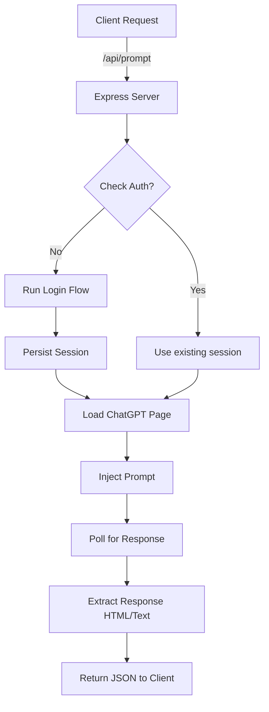

# 🧠 Unofficial ChatGPT API Node.js

> A developer-focused Node.js + Puppeteer-powered backend that exposes an unofficial OpenAI ChatGPT API by automating browser interaction with chat.openai.com—ideal for local testing, prompt chaining, and AI chatbot exploration without using official API keys.

## 🚀 Why This Project?

While OpenAI’s official APIs are powerful, they come with rate limits, cost barriers, and limited conversation thread support. This project enables developers to:

- Use their personal ChatGPT account to interact with ChatGPT programmatically.
- Automate login and session persistence using Puppeteer and stealth plugins.
- Send prompts and get responses in a structured, customizable format.
- Mimic reasoning and web search modes for enhanced answers (optional).
- Simulate a local API-like development flow for chatbot prototyping and AI experimentation.

## Note

> “Reliance on UI behavior can cause this API to be unreliable in production; it is recommended for local use only, but I'm continually working to make it more robust."

## 🧰 Tech Stack

- **Node.js** (Express) – API service
- **Puppeteer + Stealth Plugin** – ChatGPT automation
- **dotenv** – Credential & config management
- **HTML parsing** (in-progress) – To extract & process response
- **CORS, Body-Parser** – Clean JSON APIs

## 🛠️ Setup Guide

### 1. 📦 Clone & install dependencies

```bash
# Clone the repo
git clone https://github.com/roxylius/ChatGPT_unofficial_API_Node.git

# Move to the repo folder
cd ChatGPT_unofficial_API_Node

# Install all dependencies
npm install
```

### 2. ⚙️ Configure environment variables

> Note: Google Auth support is not added, Signup and generate email/password for auth

Create a `.env` file at the project root:

```env
OPENAI_EMAIL=your-chatgpt-login-email
OPENAI_PASSWORD=your-chatgpt-password
```

Replace `chatgpt-login-email` and `your-chatgpt-password` with your actual OpenAI account credentials.

### 3. ▶️ Run the server

Start the server by running:

```bash
node server.js
```

or

```
npm run dev
```

The server runs at [http://localhost:3001/](http://localhost:3001/) and will confirm “Server is up and Running……”.

## 🧪 Example Test Prompt

Run a test interaction:

```bash
npm run test
```

Test workflow:

> 🌐Launch Chrome -> 📁Load Chrome-user-data -> 🔐Login -> ✉️Send Prompt -> ⏳Poll Response -> 📄Extract Text -> 💬Return JSON

## 🔁 API Endpoints

#### POST /api/prompt

> As of latest ChatGPT update, reason automatically searches when required no need for both, only use Search when no Reasoning is required

- **Description:** Sends a prompt to ChatGPT and retrieves the response.
- **Request Body:**

```json
{
  "prompt": "Your prompt here",
  "options": { 	// this object is optional 
    "reason": false,
    "search": true,
    "threadId": "optional_thread_id"
  }
}
```

or

```json
{
  "prompt": "Your prompt here"
}
```

| Field                | Type    | Description                                   | Required |
| -------------------- | ------- | --------------------------------------------- | -------- |
| `prompt`           | String  | The text prompt to send to ChatGPT.           | Yes      |
| `options.reason`   | Boolean | Enables Reason mode (default: false).         | No       |
| `options.search`   | Boolean | Enables Search mode (default: false).         | No       |
| `options.threadId` | String  | Specifies an existing conversation thread ID. | No       |

- **Response:**

```json
{
  "threadId": "the_thread_id",
  "response": "The response from ChatGPT"
}
```

| Field        | Type   | Description                        |
| ------------ | ------ | ---------------------------------- |
| `threadId` | String | The ID of the conversation thread. |
| `response` | String | The cleaned response from ChatGPT. |

Sample Response:

```json
{
  "threadId": "681a6cba-c0fc-8004-977c-f34adf806988",
  "response": "Why don't scientists trust atoms? Because they make up everything!"
}
```

> **Note:** Response times may vary based on prompt complexity and ChatGPT’s server load. Parsing may occasionally be inconsistent, particularly in Reason mode.

## 🔌 OpenAI-Compatible API (`/v1`)

In addition to the native `/api/openai/prompt` endpoint above, the server exposes an OpenAI-compatible surface so you can point any existing OpenAI SDK / client at it as a drop-in base URL.

```
Base URL: http://localhost:3001/v1
```

```js
import OpenAI from "openai";

const client = new OpenAI({
  baseURL: "http://localhost:3001/v1",
  apiKey: "not-needed-unless-you-set-API_KEY", // any string, or your API_KEY
});

const completion = await client.chat.completions.create({
  model: "gpt-4o",
  messages: [{ role: "user", content: "Tell me a joke" }],
});

console.log(completion.choices[0].message.content);
```

#### GET /v1/models

Returns a static list of model ids for client compatibility (`gpt-4o`, `gpt-4o-search`, `gpt-4o-reason`, `gpt-4`, `gpt-3.5-turbo`).

#### POST /v1/chat/completions

Standard OpenAI request/response shape: `{ model, messages, stream }` in, an OpenAI `chat.completion` (or `chat.completion.chunk` SSE stream, if `stream: true`) object out, including a `usage` block with estimated token counts.

- **Reason / Search modes** — since the OpenAI schema has no field for these, pick them via the model name: `gpt-4o-reason` or `gpt-4o-search` (or any model id containing `reason`/`search`, e.g. `o1`, `o3`).
- **Streaming** — the underlying automation only ever returns the fully-settled response text (it polls the page until the text stops changing), so `stream: true` re-chunks that final text into word-sized SSE deltas rather than true token-by-token generation. Clients built for SSE still work correctly; just don't expect lower latency-to-first-token from it.
- **Thread continuity** — the API is otherwise stateless like OpenAI's, but each response includes a non-standard `thread_id` field with the underlying ChatGPT conversation id. The server also *best-effort* remembers threads across calls (matched by hashing the message history), so a normal "send full history back" chat loop will usually keep reusing the same ChatGPT thread automatically. To force it, pass `thread_id` explicitly in the request body.
- **Auth** — unauthenticated by default (matches the rest of this project's local-use posture). Set `API_KEY` in `.env` to require `Authorization: Bearer <API_KEY>` on all `/v1/*` routes.
- **Concurrency** — there's only one shared browser page under the hood, so `/api/openai/prompt` and `/v1/chat/completions` requests are queued and processed one at a time, not run in parallel.

## 🐳 Docker

```bash
# 1. Configure credentials
cp .env.example .env
# edit .env: set OPENAI_EMAIL / OPENAI_PASSWORD (and optionally API_KEY)

# 2. Build & run
docker compose up --build
```

The server is then reachable at `http://localhost:3001` (native API) and `http://localhost:3001/v1` (OpenAI-compatible API), exactly as when run with `node server.js` locally.

**Why Docker needs a virtual display:** this project intentionally runs Chrome headful (not headless) to avoid ChatGPT's bot detection — see the comment in `src/services/puppeteerService.js`. Since a container has no physical display, `docker-entrypoint.sh` starts Chrome under [Xvfb](https://en.wikipedia.org/wiki/Xvfb), a virtual X server, before launching the app — no code changes needed, this happens automatically. Set `PUPPETEER_HEADLESS=true` in `.env` to skip Xvfb and run headless instead (smaller/faster, but more likely to trip login/prompt detection).

**Session persistence:** `docker-compose.yml` mounts a named volume over `/app/chrome-user-data`, the same directory Puppeteer already persists cookies/localStorage to (see the directory tree below). This means you generally only have to sit through the login flow once — subsequent container restarts reuse the saved session. Without that volume, every restart re-triggers `performLoginWithBasicAuth`.

**Manual `docker build` / `docker run`** (equivalent to the compose file above, if you'd rather not use Compose):

```bash
docker build -t chatgpt-unofficial-api .

docker run -d \
  --name chatgpt-api \
  -p 3001:3001 \
  --shm-size=1gb \
  --env-file .env \
  -v chatgpt-chrome-user-data:/app/chrome-user-data \
  -v chatgpt-logs:/app/logs \
  chatgpt-unofficial-api
```

> **Note:** as with running this locally, headful browser automation against ChatGPT's login flow is inherently fragile — CAPTCHAs, 2FA, or new anti-bot checks can still interrupt the automated login inside the container. If it fails and you need to intervene visually, connect to the container's Chrome over its remote-debugging port with a VNC/noVNC setup, or run the equivalent flow outside Docker once to get familiar with the login UI it automates before troubleshooting the containerized version.

## 📂 Key Components & Dictory Tree

```
.
├── chrome-user-data/      # Persists browser session data (cookies, localStorage) — Docker volume
├── logs/                  # log4js output — Docker volume
├── src/
│   ├── configs/
│   │   └── log4js-config.json  # Logger config
│   ├── flows/
│   │   ├── openai_emailAuth.js   # Handles email/password login automation
│   │   └── openai_promptFlow.js  # Handles sending prompts and polling for responses
│   ├── router/
│   │   ├── index.js        # Mounts /api/openai and /v1 routers, CORS/body-parser middleware
│   │   ├── openai.js       # Native POST /api/openai/prompt route
│   │   └── v1.js            # OpenAI-compatible /v1/chat/completions + /v1/models routes
│   ├── services/
│   │   └── puppeteerService.js # Manages shared Puppeteer browser and page instance
│   └── utils/
│       ├── helpers.js       # Utility functions (e.g., login check, HTML→text, timeouts)
│       ├── logger.js        # log4js wrapper
│       └── pageLock.js      # Serializes requests against the single shared page
├── .env                   # Environment variables (OpenAI credentials, Port, API_KEY)
├── .env.example           # Example environment file
├── docker-compose.yml     # Build + run with persistent volumes
├── Dockerfile             # Headful Chrome + Xvfb image (see 🐳 Docker section)
├── docker-entrypoint.sh   # Starts Xvfb, then the app
├── example-test.js        # Standalone test script for Puppeteer automation
├── feature.md             # List of features and bug fixes
├── insights.md            # Important notes and observations
├── package.json           # Project metadata and dependencies
├── server.js              # Main application entry point, starts Express server and Puppeteer
└── README.md              # This file
```

## 🔧 Planned Features

- Add markdown/HTML parser for formatted output
- Add file/image support
- Improve “Reason” mode polling
- Signup support
- Enhanced thread context management

## ⚠️ Known Issues

- Small viewport may trigger mobile view and change behavior.
- “Reason” mode writes to alternate DOM nodes. [**Not working Currently!**]
- Some long responses split across multiple elements.

## 📊 Workflow Diagram



## 👩‍💻 Author

Developed with ☕ by Roxylius

## 📄 License

MIT License
